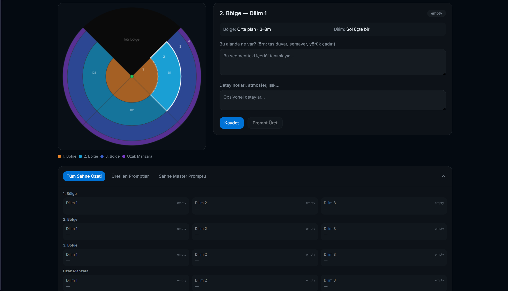

# Panoramic Dream Weaver

Panoramic Dream Weaver is a segment-based 360 scene prompt builder for AI image and video workflows. It helps you break a panoramic world into structured zones and slices, generate detailed prompts for each segment, and combine them into a coherent master prompt for immersive panoramic generation.

## What It Does

- Create and manage panoramic scenes with metadata like location, era, weather, season, and style.
- Split a 360 scene into zones and directional slices.
- Write segment-level content descriptions and notes.
- Generate per-segment prompts with Groq.
- Merge those prompts into a single master panoramic prompt.
- Upload and preview equirectangular panoramic reference images in an interactive 360 viewer.
- Store scenes, segments, images, and the Groq key locally in the browser.

## Feature Overview

- No login or backend setup
- Scene list and editor flows
- Segment-based prompt authoring
- Master prompt synthesis
- Panoramic image upload
- Groq API key entry from the top-right menu
- Interactive 360 viewer built with Three.js
- TanStack Router + TanStack Query app structure

## Stack

- React 19
- TanStack Start / Router / Query
- Vite
- Groq SDK
- Three.js
- Tailwind CSS

## Project Structure

```text
src/
  components/         UI, viewer, editor panels
  lib/                API helpers, constants, prompt generation
  routes/             App routes
```

## Environment Variables

No environment variables are required for normal local use. Open the app and save your Groq key from the top-right "Groq Key" menu.

You can still create a local `.env` file from `.env.example` if you want a development fallback:

Example:

```bash
cp .env.example .env
```

## Local Development

Install dependencies:

```bash
npm install
```

Start the dev server:

```bash
npm run dev
```

Build for production:

```bash
npm run build
```

Lint:

```bash
npm run lint
```

## Notes

- Data is stored in browser `localStorage`, so it is local to that browser/profile.
- Uploaded images are saved as data URLs in `localStorage`; keep them small.
- A valid Groq API key is required only when generating prompts.
- The current UI is functional and fast to iterate on, but still prototype-heavy.

## Suggested GitHub Description

`Local-first 360 panoramic scene prompt builder for AI image and video generation with Groq and immersive preview.`
